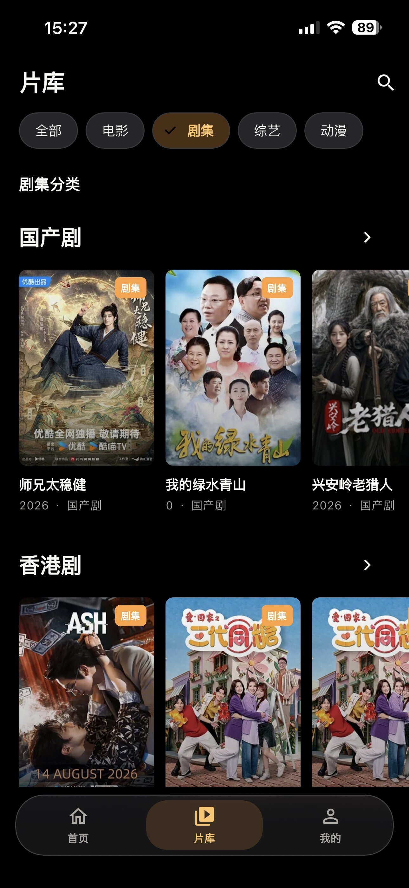

# Cineo

> 一个简洁、专注、可扩展的 Flutter 影视发现与播放客户端。

<div align="center">
  
</div>

<div align="center">
  <a href="README_EN.md">English</a>
</div>

## 中文说明

Cineo 是一个以本地数据为中心的跨平台影视发现与播放 APP。它支持管理多个视频源，导入兼容 MacCMS 的资源站 JSON 配置，并通过统一的界面完成影视浏览、搜索、详情查看、播放、收藏和观看进度管理。

Cineo 的产品思路和交互方向主要借鉴了 [KatelyaTV](https://github.com/katelya77/KatelyaTV) 项目，并在此基础上使用 Flutter 重新实现为跨平台 APP。感谢 KatelyaTV 项目对本项目设计和开发带来的启发。

> 当前应用默认使用内置演示媒体库启动。要加载真实内容，请在应用的“视频源”页面添加或导入 API 视频源，并将其设为默认来源。

### 项目亮点

- **多源聚合**：统一管理多个资源站，支持来源启用、禁用、收藏、删除和连通性测试。
- **JSON 配置导入**：支持导入包含 `api_site` 的 MacCMS 资源站 JSON 配置，快速建立媒体来源。
- **本地优先**：收藏、观看进度、继续观看、搜索历史和来源偏好保存在本地，减少重复配置。
- **完整观影流程**：覆盖首页推荐、分类浏览、搜索、影视详情、剧集选择和视频播放。
- **跨来源播放**：播放页支持渐进式搜索其他视频源，结果会持续追加，并可直接切换播放线路。
- **HLS 缓存下载**：支持缓存电影或剧集的 HLS 视频，提供队列、暂停、继续、重试、取消和本地播放。
- **TMDB 数据增强**：可选接入 TMDB，补充海报、背景图、演员、季和单集简介等信息。
- **播放增强**：支持自定义 M3U8 代理过滤、系统播放器和平台支持的画中画播放。
- **隐私与安全**：TMDB Token 使用安全存储，应用锁支持 PIN 验证、错误退避锁定和后台返回宽限期。
- **版本检查**：在“我的”页面检查 GitHub Release，并查看 Markdown 格式的版本日志。
- **跨平台基础**：基于 Flutter 构建，仓库包含 Android、iOS 和 Web 工程配置。

### APP 预览

默认展示 4 张界面截图：

<div align="center">
  
  
  
  
</div>

### 功能特性

- 首页影视内容分区、分类浏览和横向媒体列表
- 影视搜索、详情页、剧集与单集信息展示
- HLS（`.m3u8`）和 MP4 播放
- 播放页渐进式搜索其他视频源，显示来源封面和搜索进度，并支持切换线路
- 系统播放器和画中画播放（具体能力取决于平台）
- HLS 视频缓存下载：电影、剧集、批量加入、暂停、继续、重试、取消和本地播放
- 下载管理器：按媒体查看任务、查看缓存占用、清空缓存；支持 1 到 10 个并发任务和可选后台下载
- 多视频源管理：添加、编辑、启用/禁用、收藏、删除和连通性测试
- MacCMS 兼容 API：目录、分页、分类、详情和播放地址解析
- 粘贴导入 `api_site` 格式的 MacCMS 资源站 JSON 配置
- 远程分类同步：按来源刷新分类、保留本地启用状态，并按来源选择竖屏或横屏封面布局
- 默认视频源和同名影视的来源偏好记忆
- 收藏、观看进度、继续观看和搜索历史本地持久化
- TMDB 数据增强：海报、背景图、详情、演员、季和单集简介
- TMDB 元数据与图片磁盘缓存，可查看统计、清理过期缓存或清空缓存
- M3U8 广告过滤：配置一个包含 `${YOUR_M3U8_URL}` 占位符的 HTTP(S) 代理地址，并在播放或下载 HLS 前应用
- 应用锁 PIN、失败尝试退避锁定和后台返回宽限期
- 成人标记视频源单独管理，并由应用锁保护显示开关
- 应用内版本检查、备用检查源和 GitHub Release 下载页跳转

### 技术栈

- Flutter / Dart
- Material 3
- `sqflite`：本地媒体状态、视频源、收藏和观看记录
- `shared_preferences`：非敏感的偏好设置
- `flutter_secure_storage`：应用锁验证信息和 TMDB Token
- `video_player`：视频播放
- `flutter_markdown`：应用内渲染版本日志
- `package_info_plus`：读取当前应用版本
- `path_provider`：TMDB 缓存目录
- `url_launcher`：外部链接打开

### 环境要求

- Flutter SDK
- Dart SDK `>=3.1.5 <4.0.0`
- Android 项目使用 compile SDK 34
- macOS 和 Xcode（仅 iOS 本地构建需要）

建议先确认本机环境：

```bash
flutter doctor
flutter --version
```

### 快速开始

安装依赖并运行开发版本：

```bash
flutter pub get
flutter run
```

指定设备运行：

```bash
flutter devices
flutter run -d <device-id>
```

常用构建命令：

```bash
# Android APK
flutter build apk

# Android App Bundle
flutter build appbundle

# iOS（需要 macOS 和 Xcode）
flutter build ios

# Web
flutter build web
```

### 配置视频源

打开应用的“视频源”页面，可以手动添加来源，也可以导入 MacCMS 兼容的 JSON 配置。

#### 手动添加

支持以下来源类型：

| 类型 | 地址要求 | 用途 |
| --- | --- | --- |
| 直链 HLS / MP4 | 必须是以 `.m3u8` 或 `.mp4` 结尾的 HTTP(S) 地址 | 播放单个直链视频 |
| MacCMS 兼容 API | HTTP(S) API 地址 | 获取目录、分类、详情和播放地址 |
| JSON API | HTTP(S) API 地址 | 按已实现的 MacCMS JSON 结构读取站点数据 |

API 来源经过连通性测试后，才可以设置为默认视频源。默认来源负责首页、搜索和分类浏览；没有配置默认 API 来源时，应用会使用内置演示目录作为回退内容。

API 来源的“分类配置”页面可以刷新远程分类、启用或关闭分类，并选择该来源的竖屏或横屏封面比例。刷新失败或远程返回空分类时，应用会保留已有的本地配置；分类树请求会优先使用叶子分类，避免父分类和子分类重复请求。

#### 基础版资源站配置

你可以下载 [KatelyaTV 基础版视频源配置](https://www.mediafire.com/file/upztrjc0g1ynbzy/config_isadult.json/file)。该配置包含 20+ 个 MacCMS 资源站，具体来源和配置说明请参考 [KatelyaTV](https://github.com/katelya77/KatelyaTV)。当前基础版配置包含：电影天堂、黑木耳、如意资源、暴风资源、天涯资源、非凡影视、360 资源、茅台资源、卧龙资源、极速资源、豆瓣资源、魔爪资源、魔都资源、最大资源、樱花资源、无尽资源、旺旺短剧、iKun 资源、量子资源站和小猫咪资源。

下载配置后，可在应用的“视频源”页面导入，然后执行连通性测试、启用需要使用的来源并选择默认视频源。资源站地址、内容和可用性由第三方维护，可能随时变更；请仅配置和访问你有权使用的资源站及其内容。

#### 导入资源站 JSON

导入功能接受包含 `api_site` 的 JSON 对象，例如：

```json
{
  "cache_time": 7200,
  "api_site": {
    "example": {
      "name": "示例资源站",
      "api": "https://example.com/api.php/provide/vod/",
      "detail": "https://example.com",
      "is_adult": false
    }
  }
}
```

字段说明：

- `cache_time`：可选的正整数缓存时间，单位为秒。
- `api_site`：必填对象，键名会作为来源 ID。
- `name`：来源显示名称。
- `api`：来源 API 地址，必须包含主机名。
- `detail`：可选的站点详情地址。
- `is_adult`：可选布尔值，用于标记成人来源。

导入只解析和保存本地配置，不会在导入时访问站点。默认建议使用 HTTPS；只有在确认站点可信且确实需要时，才开启“允许 HTTP 站点”。请仅配置和访问你有权使用的资源站及其内容。

### 配置 TMDB 数据增强

1. 在 TMDB 账户中创建 API Read Access Token。
2. 打开应用“设置”中的“TMDB 数据增强”。
3. 粘贴 Token 并保存。
4. 打开影视详情时，Cineo 会按标题、类型和年份匹配 TMDB 内容。

TMDB Token 通过 `flutter_secure_storage` 保存在本机，不会写入 URL，也不会在异常信息中输出。TMDB 详情、图片和人工匹配结果会写入应用支持目录下的 `cineo_tmdb_cache` 缓存目录，默认元数据缓存时间为 30 天；缓存内容可以在 TMDB 设置页管理。

### 播放、缓存与下载

在影视详情页点击“缓存下载”可以加入电影或剧集的 HLS 地址。剧集支持逐集加入，也可以一次加入当前季的全部可缓存集数。下载管理器会持久化任务状态，支持暂停、继续、重试、取消和删除缓存；完成后可以从本地文件播放，不需要重复请求远程视频片段。

缓存下载仅支持完整的点播 HLS 清单。直播流或不完整清单不会加入下载。下载设置可以调整同时下载任务数（1 到 10）以及是否允许应用进入后台后继续下载。缓存任务和媒体信息保存在本机，清空缓存会删除已下载的视频文件。

在“设置 > M3U8 广告过滤”中可以添加代理模板，例如：

```text
https://filter.example.com/proxy?url=${YOUR_M3U8_URL}
```

启用的过滤配置会在 HLS 播放和缓存下载前替换原始 M3U8 地址。代理服务由用户自行提供，必须支持目标播放器需要的 HLS 响应；代理不可用时应关闭配置或更换地址。

播放页还提供系统播放器和画中画入口。系统播放器、画中画、后台下载等能力受操作系统和设备限制；Web 目标不保证具备移动端原生能力。

### 应用内版本更新

“我的 > 版本更新”会读取 GitHub Release 的最新版本和更新日志。应用先请求 GitHub Releases API，失败时尝试 Releases Atom 源；页面可以手动重新检查，并跳转到 GitHub Release 下载页。版本检查需要网络访问，不会自动替用户安装更新。

### 本地数据与隐私

应用使用 SQLite 数据库保存本地状态，默认数据库文件名为 `cineo_local_media.db`。数据包括：

- 视频源配置及启用状态
- 默认来源、收藏来源和来源健康检查结果
- 收藏媒体与媒体展示快照
- 观看进度和继续观看记录
- 搜索历史
- 同一影视的来源选择偏好
- HLS 下载任务、下载进度和本地缓存索引

非敏感的应用偏好（例如 M3U8 过滤配置、下载设置和成人内容显示选项）使用 `shared_preferences` 保存。TMDB Token 和应用锁验证信息使用 `flutter_secure_storage` 保存。下载的视频文件位于应用支持目录，由应用内下载管理器负责维护。

应用锁不会保存明文 PIN，而是保存带随机盐的 PBKDF2 验证信息。连续输入错误会触发逐步延长的临时锁定。

### 项目结构

```text
lib/
├── core/                 共享模型、主题、演示数据和平台能力
├── data/                 远程客户端、缓存和媒体仓库
├── features/             首页、搜索、详情、播放、设置等功能模块
└── shared/widgets/       公共媒体卡片、图片和内容状态组件
```

测试代码位于 `test/`，覆盖数据解析、分类适配、TMDB 缓存、HLS 清单和下载服务、视频源导入、仓库、应用锁、播放器和主要页面组件。

### 测试与静态检查

运行全部测试和代码分析：

```bash
flutter test
flutter analyze
```

运行单个测试文件：

```bash
flutter test test/mac_cms_client_test.dart
flutter test test/features/home/home_screen_test.dart
```

格式化 Dart 代码：

```bash
dart format lib test
```

### 版本与发布

当前仓库版本为 `1.3.3+10`。仓库提供 `Makefile` 和 `.github/workflows/cineo-build.yml`，用于统一版本号、本地构建和 GitHub Actions 构建。

查看可用命令：

```bash
make help
```

发布前请在 `Makefile` 顶部维护公开版本和内部构建号：

```make
VERSION := 1.3.3
BUILD_NUMBER := 10
```

常用版本和构建命令：

```bash
# 指定版本并同步 pubspec.yaml、Android 和 iOS 元数据
make version VERSION=1.4.0 BUILD_NUMBER=11

# 自动递增版本
make bump-patch
make bump-minor
make bump-major

# 本地构建已签名 Android APK
make android

# 本地构建未签名 iOS IPA（需要 macOS 和 Xcode）
make ios

# 同时构建 Android 和 iOS
make build
```

发布时执行 `make publish`。该命令会调用发布脚本同步版本、提交并推送当前分支，然后创建类似 `v1.4.0` 的版本 tag。GitHub Actions 监听 `v*` tag，收到 tag 推送后自动构建并发布对应的 GitHub Release。重新构建同一个公开版本时，需要明确执行 `make publish REBUILD=1`。发布命令会产生提交和远程推送，请在确认分支和版本号无误后执行。

Android 本地发布构建会使用本地签名配置；iOS 默认生成未签名 IPA。请妥善备份 Android keystore 和密码，并使用合法、合规的签名与分发流程。

### 平台说明

- Android 声明了网络访问权限，并通过原生 `MethodChannel` 提供系统播放器和画中画能力。
- iOS 包含系统播放器和画中画相关的原生 Runner 实现；具体能力取决于系统版本、播放器和设备。
- Web 工程可构建，但 `sqflite`、安全存储、下载本地服务器、画中画和部分平台能力是否可用取决于 Flutter 插件实现与运行环境。

### 许可证与第三方内容

当前仓库未声明开源许可证。除非项目维护者另行授权，请不要将本项目或其附带的媒体源配置、图片和第三方内容用于未经许可的分发。

本项目不提供、不托管任何影视资源。用户需要自行配置合法、可访问的视频源，并遵守所在地区的法律法规以及相关服务条款。TMDB、视频源站点和其他第三方服务分别遵循其各自的许可证与使用条款。
