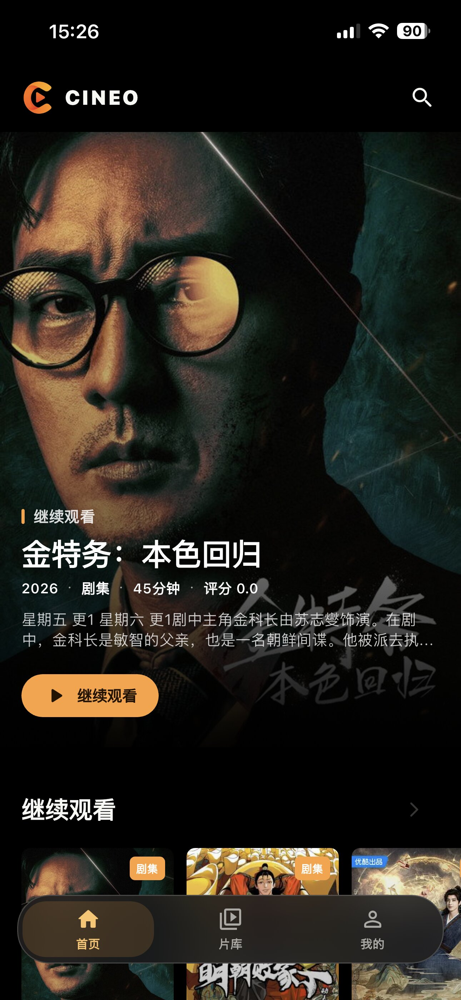
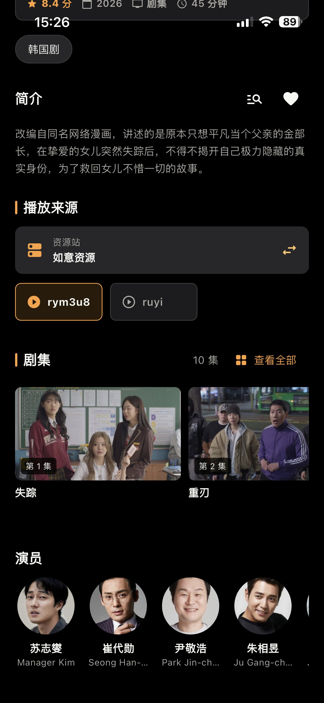
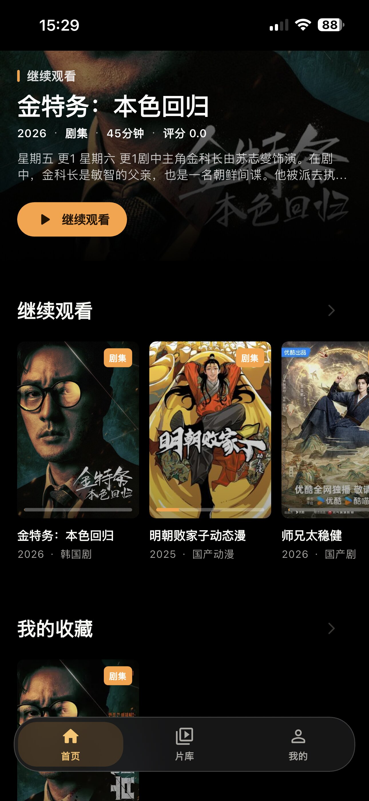
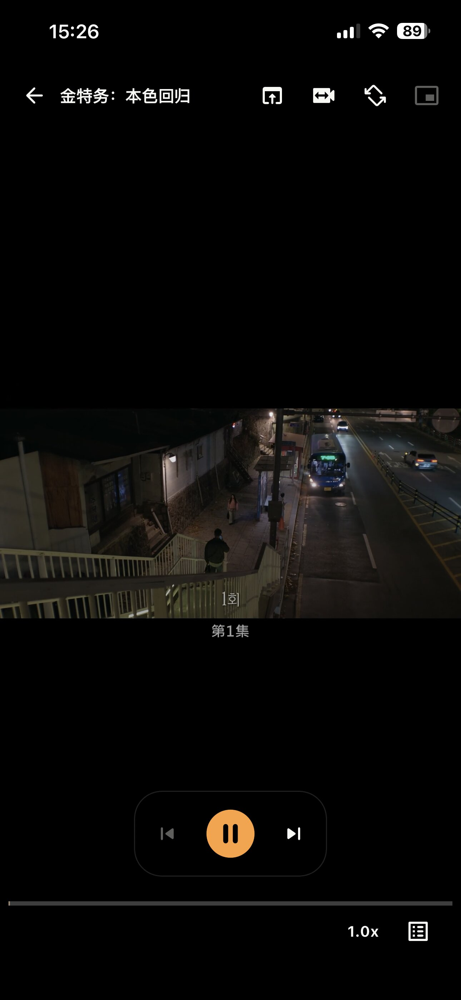

# Cineo

> A focused, extensible Flutter client for discovering and playing media.

<div align="center">
  
</div>

<div align="center">
  <a href="README.md">中文说明</a>
</div>

Cineo is a local-first, cross-platform Flutter app for discovering and playing media. It lets you manage multiple video sources, import MacCMS-compatible JSON configurations, browse catalogs, search titles, inspect details, play episodes, save favorites, and resume playback.

The product direction and interaction concepts are primarily inspired by [KatelyaTV](https://github.com/katelya77/KatelyaTV). Cineo is an independent Flutter app implementation built on top of that inspiration. Many thanks to the KatelyaTV project for the ideas that helped shape this app.

> The app starts with a built-in demo library by default. To load real content, add or import an API source from the “Video Sources” page and set it as the default source.

## Highlights

- **Multi-source aggregation**: Manage multiple media sources with enable, disable, favorite, delete, and connectivity-test actions.
- **JSON configuration import**: Import MacCMS-compatible JSON configurations containing an `api_site` object.
- **Local-first experience**: Keep favorites, watch progress, watch history, search history, and source preferences locally.
- **Complete viewing flow**: Browse home sections, categories, search results, media details, seasons, and episodes.
- **Cross-source playback**: Progressively search other sources from the player, append results as they arrive, and switch playback sources without leaving the player.
- **HLS downloads**: Cache movies or episodes with queueing, pause, resume, retry, cancellation, and local playback.
- **TMDB enrichment**: Optionally add posters, backdrops, cast, seasons, and episode summaries.
- **Playback enhancements**: Configure an M3U8 proxy filter, open the system player, and use picture-in-picture where supported.
- **Privacy and security**: Store TMDB credentials securely and protect the app with PIN verification, progressive lockout, and a background grace period.
- **In-app update checks**: Check GitHub Releases and read Markdown release notes from the profile page.
- **Cross-platform foundation**: Build from the same Flutter codebase for Android, iOS, and Web targets.

## Preview

The README intentionally shows four representative screenshots:

<div align="center">
  
  
  
  
</div>

## Features

- Home sections, category browsing, and horizontal media rails
- Media search, details, seasons, and episode information
- HLS (`.m3u8`) and MP4 playback
- Progressive search across other video sources, with source artwork, progress updates, and in-player source switching
- System-player and picture-in-picture entry points where supported by the platform
- HLS caching for movies and episodes, including batch enqueue, pause, resume, retry, cancellation, and local playback
- Download manager with per-media task groups, cache usage, cache clearing, 1-10 concurrent tasks, and optional background downloads
- Multi-source aggregation: add, edit, enable, disable, favorite, delete, and connectivity-test sources
- MacCMS-compatible API: catalogs, pagination, categories, details, and playback URL parsing
- Import `api_site`-formatted MacCMS source configurations
- Remote category sync: refresh source categories, preserve local enabled states, and choose portrait or landscape cover layouts per source
- Default source and same-title source-selection preferences
- Favorites, watch progress, continue watching, and search history persisted locally
- TMDB enrichment: posters, backdrops, details, cast, seasons, and episode summaries
- TMDB metadata and image disk cache with statistics, expired-cache cleanup, and full cache clearing
- M3U8 ad filtering: configure an HTTP(S) proxy template containing `${YOUR_M3U8_URL}` and apply it before HLS playback or downloads
- PIN app lock, progressive failed-attempt lockout, and a background grace period
- Separate adult-source management protected by the app lock
- In-app update checks, fallback release lookup, and a link to the GitHub Release download page

## Tech stack

- Flutter / Dart
- Material 3
- `sqflite` for local media state, sources, favorites, and watch history
- `shared_preferences` for non-sensitive preferences
- `flutter_secure_storage` for app-lock verification data and the TMDB token
- `video_player` for video playback
- `flutter_markdown` for rendering release notes in the app
- `package_info_plus` for reading the current app version
- `path_provider` for the TMDB cache directory
- `url_launcher` for opening external links

## Requirements

- Flutter SDK
- Dart SDK `>=3.1.5 <4.0.0`
- Android compile SDK 34
- macOS and Xcode for local iOS builds

Check the local environment before running the app:

```bash
flutter doctor
flutter --version
```

## Getting started

Install dependencies and run the development version:

```bash
flutter pub get
flutter run
```

Run on a specific device:

```bash
flutter devices
flutter run -d <device-id>
```

Useful build commands:

```bash
# Android APK
flutter build apk

# Android App Bundle
flutter build appbundle

# iOS (requires macOS and Xcode)
flutter build ios

# Web
flutter build web
```

## Configuring video sources

Open the “Video Sources” page to add a source manually or import a MacCMS-compatible JSON configuration.

### Supported source types

| Type | Address requirements | Purpose |
| --- | --- | --- |
| Direct HLS / MP4 | An HTTP(S) URL ending in `.m3u8` or `.mp4` | Play a single direct video stream |
| MacCMS-compatible API | An HTTP(S) API URL | Load catalogs, categories, details, and playback URLs |
| JSON API | An HTTP(S) API URL | Read source data using the implemented MacCMS JSON structure |

An API source must pass the connectivity test before it can be selected as the default source. The default source powers the home page, search, and category browsing. Without a configured API source, the app falls back to its built-in demo catalog.

The source “Category Configuration” page can refresh remote categories, enable or disable categories, and choose portrait or landscape cover layouts for that source. Existing local settings are preserved when a refresh fails or the remote source returns no categories. Category-tree requests prefer leaf categories so parent and child categories are not requested redundantly.

### Basic source configuration

You can download the [KatelyaTV basic video-source configuration](https://www.mediafire.com/file/upztrjc0g1ynbzy/config_isadult.json/file). It contains 20+ MacCMS-compatible sources. See [KatelyaTV](https://github.com/katelya77/KatelyaTV) for the source and configuration details. The basic configuration currently includes: 电影天堂, 黑木耳, 如意资源, 暴风资源, 天涯资源, 非凡影视, 360 资源, 茅台资源, 卧龙资源, 极速资源, 豆瓣资源, 魔爪资源, 魔都资源, 最大资源, 樱花资源, 无尽资源, 旺旺短剧, iKun 资源, 量子资源站, and 小猫咪资源.

After downloading the configuration, import it from the “Video Sources” page, run a connectivity test, enable the sources you want to use, and choose a default source. Source URLs, content, and availability are maintained by third parties and may change at any time. Only configure and access sources and content that you are authorized to use.

### Importing a source configuration

The import flow accepts a JSON object containing `api_site`, for example:

```json
{
  "cache_time": 7200,
  "api_site": {
    "example": {
      "name": "Example Source",
      "api": "https://example.com/api.php/provide/vod/",
      "detail": "https://example.com",
      "is_adult": false
    }
  }
}
```

Field notes:

- `cache_time`: Optional positive integer cache duration in seconds.
- `api_site`: Required object; each key becomes a source ID.
- `name`: Display name for the source.
- `api`: Source API URL; a valid hostname is required.
- `detail`: Optional site details URL.
- `is_adult`: Optional boolean used to mark an adult source.

Import only parses and stores the configuration locally; it does not contact the source during import. HTTPS is recommended. Only configure sources and content that you are authorized to access.

## TMDB enrichment

1. Create a TMDB API Read Access Token in your TMDB account.
2. Open “TMDB Enrichment” in the app settings.
3. Paste and save the token.
4. Open a media detail page; Cineo will match metadata by title, type, and year.

The TMDB token is stored locally through `flutter_secure_storage`. It is not placed in URLs or printed in exception messages. TMDB metadata, images, and manual matches are stored in the `cineo_tmdb_cache` support directory. The default metadata cache duration is 30 days, and the cache can be managed from the TMDB settings page.

### Playback, downloads, and updates

Tap “Download” on a media detail page to enqueue a movie or an episode with an HLS source. Episodes can be queued individually or as a batch for the current season. The download manager persists task state and supports pause, resume, retry, cancellation, cache deletion, and playback from the completed local file without requesting the remote segments again.

Downloads support complete on-demand HLS playlists only. Live streams and incomplete playlists are not supported. Download settings control the number of concurrent tasks from 1 to 10 and whether downloads may continue while the app is in the background. Downloaded files and task metadata remain on the device; clearing the download cache deletes the downloaded video files.

In “Settings > M3U8 Ad Filtering”, add a proxy template such as:

```text
https://filter.example.com/proxy?url=${YOUR_M3U8_URL}
```

The enabled filter is applied to an HLS URL before playback and caching. The proxy service is user-provided and must return an HLS response compatible with the player. Disable the configuration or replace the URL if the proxy is unavailable.

The player also exposes system-player and picture-in-picture actions. System playback, picture-in-picture, background downloads, and local file serving depend on the operating system and device. The Web target does not guarantee the mobile-native capabilities.

The “Profile > App Updates” page checks GitHub Releases for the latest version and release notes. It first uses the GitHub Releases API and falls back to the Releases Atom feed if the API request fails. The page supports manual re-checks and opens the GitHub Release download page; it does not install updates automatically.

## Local data and privacy

Cineo uses SQLite for local state. The default database file is `cineo_local_media.db`. Stored data includes:

- Video source configuration and enabled state
- Default, favorite, and source health-check results
- Favorite media and display snapshots
- Watch progress and continue-watching records
- Search history
- Source-selection preferences for the same title
- HLS download tasks, progress, and local-cache indexes

Non-sensitive preferences such as M3U8 filter configurations, download settings, and adult-content visibility are stored with `shared_preferences`. The TMDB token and app-lock verification data are stored with `flutter_secure_storage`. Downloaded video files are kept in the application support directory and managed by the in-app download manager.

The app lock does not store a plain-text PIN. It stores PBKDF2 verification data with a random salt. Repeated failed attempts trigger progressively longer temporary lockouts.

## Project structure

```text
lib/
├── core/                 Shared models, theme, demo data, and platform capabilities
├── data/                 Remote clients, caches, and media repositories
├── features/             Home, search, details, player, settings, and other features
└── shared/widgets/       Shared media cards, images, and content-state widgets
```

Tests are located under `test/` and cover data parsing, category adaptation, TMDB caching, HLS playlists and download services, source import, repositories, app lock, player behavior, and key page components.

## Development checks

Run the full test suite and static analysis:

```bash
flutter test
flutter analyze
```

Run an individual test file:

```bash
flutter test test/mac_cms_client_test.dart
flutter test test/features/home/home_screen_test.dart
```

Format Dart source:

```bash
dart format lib test
```

## Versioning and releases

The current repository version is `1.3.3+10`. The repository provides a `Makefile` and `.github/workflows/cineo-build.yml` for version management, local builds, and GitHub Actions builds.

List available commands:

```bash
make help
```

Before a release, maintain the public version and internal build number at the top of `Makefile`:

```make
VERSION := 1.3.3
BUILD_NUMBER := 10
```

Common version and build commands:

```bash
# Set a version and synchronize pubspec.yaml, Android, and iOS metadata
make version VERSION=1.4.0 BUILD_NUMBER=11

# Automatically bump the version
make bump-patch
make bump-minor
make bump-major

# Build a locally signed Android APK
make android

# Build an unsigned iOS IPA (requires macOS and Xcode)
make ios

# Build Android and iOS
make build
```

Run `make publish` to publish a release. The command invokes the release script, synchronizes the version, commits and pushes the current branch, and creates a tag such as `v1.4.0`. GitHub Actions listens for `v*` tags and publishes the corresponding GitHub Release. To rebuild an existing public version, explicitly run `make publish REBUILD=1`. Publishing creates a commit and pushes to the remote, so verify the branch and version before running it.

Local Android release builds use the local signing configuration. iOS builds produce an unsigned IPA by default. Back up the Android keystore and its passwords, and use a lawful signing and distribution process.

## Platform notes

- Android declares network access and provides system-player and picture-in-picture support through native platform code and a `MethodChannel`.
- iOS includes native Runner support for system playback and picture-in-picture; exact behavior depends on the OS version, player, and device.
- The Web target can be built, but support for `sqflite`, secure storage, the local download server, picture-in-picture, and other platform capabilities depends on the Flutter plugin implementations and runtime environment.

## License and content notice

This repository currently has no declared open-source license. Do not redistribute the project, bundled media-source configurations, images, or third-party content without permission from the maintainers and the respective rights holders.

Cineo does not provide or host any media content. Users are responsible for configuring lawful sources and complying with applicable laws and third-party terms of service. TMDB, source websites, and other third-party services are governed by their own licenses and terms.
